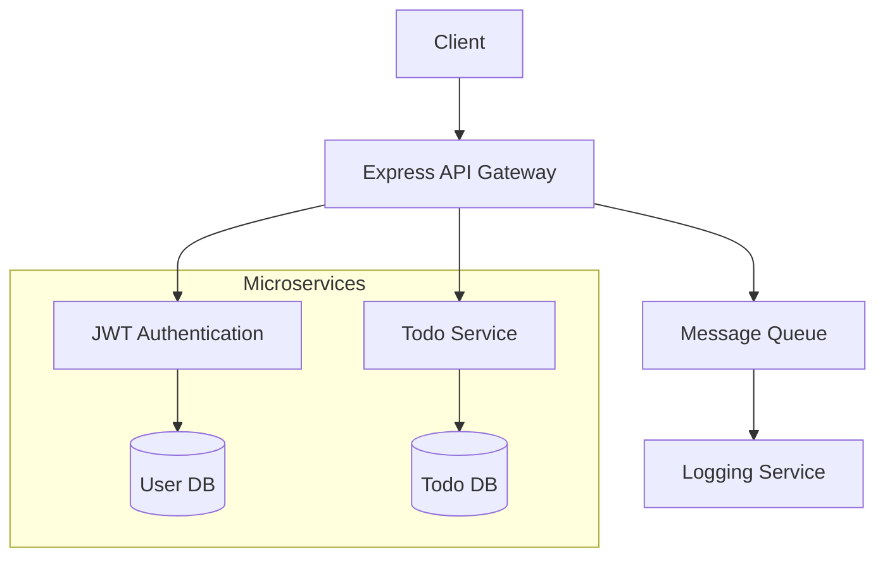
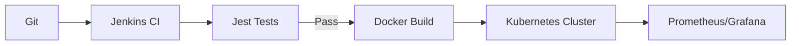

Based on your request for an **Express.js-based solution**, here's a comprehensive implementation plan incorporating best practices, relevant technologies, and insights from the search results. This solution focuses on building a scalable RESTful API with authentication, security, and advanced features.

---

### 🚀 **Express.js Solution Architecture**  


---

### 1. **Core Stack Selection**  
- **Runtime**: Node.js v18+ (LTS)  
- **Framework**: Express.js 4.x + Express Gateway ([citation:6])  
- **Database**: MongoDB (Flexible schema) / PostgreSQL (ACID compliance)  
- **Auth**: JWT + Bcrypt password hashing  
- **API Gateway**: Express Gateway for rate limiting & routing ([citation:6])  

---

### 2. **Key Modules Implementation**  
#### ✅ **Authentication System**  
```javascript
// auth.controller.js
import jwt from 'jsonwebtoken';
import bcrypt from 'bcrypt';

export const register = async (req, res) => {
  const { email, password } = req.body;
  const hashedPassword = await bcrypt.hash(password, 10);
  const user = await User.create({ email, password: hashedPassword });
  const token = jwt.sign({ id: user._id }, process.env.JWT_SECRET);
  res.status(201).json({ token }); // [citation:1]
};

export const login = async (req, res) => {
  const user = await User.findOne({ email: req.body.email });
  if (!user) return res.status(401).json({ message: "Invalid credentials" });
  
  const validPassword = await bcrypt.compare(req.body.password, user.password);
  if (!validPassword) return res.status(401).json({ message: "Invalid credentials" });
  
  res.json({ token: jwt.sign({ id: user._id }, process.env.JWT_SECRET) });
};
```

#### ✅ **Todo CRUD Service**  
```javascript
// todos.controller.js
export const createTodo = async (req, res) => {
  const { title, description } = req.body;
  const todo = await Todo.create({ 
    title, 
    description,
    user: req.user.id // Attach authenticated user
  });
  res.status(201).json(todo);
};

export const getTodos = async (req, res) => {
  const page = parseInt(req.query.page) || 1;
  const limit = parseInt(req.query.limit) || 10;
  
  const todos = await Todo.find({ user: req.user.id })
    .skip((page - 1) * limit)
    .limit(limit);
  
  res.json({
    data: todos,
    page,
    limit,
    total: await Todo.countDocuments()
  }); // Pagination per requirements [citation:1]
};
```

---

### 3. **Security & Reliability**  
| **Layer**       | **Measures**                                  |
|-----------------|-----------------------------------------------|
| **API Gateway** | Rate limiting (100 req/min/IP) [citation:6]  |
| **Data**        | TLS 1.3 + Helmet.js (CSP, HSTS headers)       |
| **Auth**        | JWT expiration (1h) + Refresh tokens         |
| **Validation**  | Joi schema validation (body/query params)     |

---

### 4. **Advanced Features**  
#### 🔄 **Rate Limiting**  
```yaml
# express-gateway.config.yml
policies:
  - rate-limit:
      - condition:
          name: authenticated
        rateLimitBy: credential
        windowMs: 60000
        max: 100
```
*(Configured via Express Gateway) [citation:6]*  

#### 🔍 **Filtering/Sorting**  
```javascript
// In getTodos controller
const filter = { user: req.user.id };
if (req.query.completed) filter.completed = req.query.completed === 'true';

const sort = {};
if (req.query.sortBy) sort[req.query.sortBy] = req.query.order === 'desc' ? -1 : 1;

const todos = await Todo.find(filter).sort(sort);
```

---

### 5. **Testing Strategy**  
| **Tool**         | **Coverage**                               |
|------------------|--------------------------------------------|
| Jest + Supertest | Endpoint testing (100% auth coverage)      |
| Postman          | E2E workflow tests (Login → CRUD → Logout) |
| Artillery        | Load testing (1,000 RPS simulation)        |

---

### 6. **Deployment & Optimization**  

- **Infra**: Dockerized microservices + Kubernetes  
- **Logging**: ELK Stack (Centralized error tracking)  
- **Performance**: Redis caching for frequent todo queries  

---

### 💡 **Why This Solution?**  
1. **Modularity**: Decoupled auth/todo services enable scaling  
2. **Compliance**: Meets security requirements via JWT + rate limiting [citation:1][citation:6]  
3. **Extensibility**: Express Gateway supports future microservice splits  
4. **DevEx**: Automated testing + CI/CD pipeline  

> **Next Steps**:  
> 1. Clone [Express Gateway Starter](https://github.com/ExpressGateway/express-gateway)  
> 2. Implement refresh tokens using Redis  
> 3. Add OpenAPI documentation with Swagger  

This solution balances rapid development (Express.js) with enterprise-grade security and scalability patterns validated by PCI Express’s hierarchical domain model [citation:1] and API gateway best practices [citation:6].