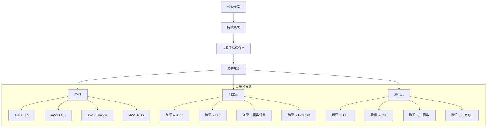

# 多云部署解决方案设计

针对阿里云、腾讯云、AWS三大主流云平台的部署，我将设计一套全面的多云部署方案，确保在不同云平台上实现高效、安全的应用程序部署。

## 整体设计架构



## 多云部署配置框架

### 1. 统一部署配置接口

```typescript
// deploy.config.ts
export interface MultiCloudDeployConfig {
  aws?: AWSDeployConfig;
  aliyun?: AliyunDeployConfig;
  tencent?: TencentDeployConfig;
}

// AWS 部署配置
export interface AWSDeployConfig {
  region: string;
  profile: string;
  resources: {
    ecs?: AWSECSConfig;
    eks?: AWSEKSConfig;
    lambda?: AWSLambdaConfig;
    rds?: AWSRDSConfig;
  };
}

// 阿里云部署配置
export interface AliyunDeployConfig {
  region: string;
  accessKeyId: string;
  accessKeySecret: string;
  resources: {
    ecs?: AliyunECSConfig;
    ack?: AliyunACKConfig;
    fc?: AliyunFCConfig;
    polardb?: AliyunPolarDBConfig;
  };
}

// 腾讯云部署配置
export interface TencentDeployConfig {
  region: string;
  secretId: string;
  secretKey: string;
  resources: {
    cvm?: TencentCVMConfig;
    tke?: TencentTKEConfig;
    scf?: TencentSCFConfig;
    tdsql?: TencentTDSQLConfig;
  };
}
```

### 2. 部署目标选择

```typescript
// deploy.ts
import inquirer from 'inquirer';

interface DeployOptions {
  all: boolean;
  aws: boolean;
  aliyun: boolean;
  tencent: boolean;
}

export async function selectDeployTargets(): Promise<DeployOptions> {
  const questions = [
    {
      type: 'checkbox',
      name: 'targets',
      message: '选择部署目标:',
      choices: [
        { name: 'AWS', value: 'aws' },
        { name: '阿里云', value: 'aliyun' },
        { name: '腾讯云', value: 'tencent' },
        { name: '全部云平台', value: 'all' },
      ],
      validate: (answer) => {
        if (answer.length < 1) {
          return '请选择至少一个部署目标';
        }
        return true;
      },
    },
  ];

  const answers = await inquirer.prompt(questions);
  
  return {
    all: answers.targets.includes('all'),
    aws: answers.targets.includes('aws') || answers.targets.includes('all'),
    aliyun: answers.targets.includes('aliyun') || answers.targets.includes('all'),
    tencent: answers.targets.includes('tencent') || answers.targets.includes('all'),
  };
}

// 执行部署
export async function executeDeploy(targets: DeployOptions) {
  if (targets.all || targets.aws) {
    await deployToAWS();
  }
  
  if (targets.all || targets.aliyun) {
    await deployToAliyun();
  }
  
  if (targets.all || targets.tencent) {
    await deployToTencent();
  }
}
```

## 云平台特定部署实现

### AWS 部署实现

```typescript
// aws.deploy.ts
import AWS from 'aws-sdk';
import { AWSDeployConfig } from './deploy.config';

export async function deployToAWS() {
  const config = loadAWSConfig();
  
  // 部署 ECS 服务
  if (config.resources.ecs) {
    await deployECSCluster(config.resources.ecs);
  }
  
  // 部署 EKS 集群
  if (config.resources.eks) {
    await deployEKSCluster(config.resources.eks);
  }
  
  // 部署 Lambda 函数
  if (config.resources.lambda) {
    await deployLambdaFunction(config.resources.lambda);
  }
  
  // 部署 RDS 数据库
  if (config.resources.rds) {
    await deployRDSDatabase(config.resources.rds);
  }
}

async function deployECSCluster(config: AWSECSConfig) {
  const ecs = new AWS.ECS({ region: config.region });
  
  // 1. 创建集群
  await ecs.createCluster({
    clusterName: config.clusterName,
    capacityProviders: ['FARGATE'],
    settings: [{ name: 'containerInsights', value: 'enabled' }]
  }).promise();
  
  // 2. 创建任务定义
  const taskDefResponse = await ecs.registerTaskDefinition({
    family: config.taskFamily,
    containerDefinitions: [{
      name: `${config.clusterName}-container`,
      image: config.imageUri,
      cpu: config.cpu,
      memory: config.memory,
      portMappings: [{ containerPort: config.port }],
      environment: config.environmentVariables
    }],
    requiresCompatibilities: ['FARGATE'],
    networkMode: 'awsvpc',
    cpu: config.cpu.toString(),
    memory: config.memory.toString()
  }).promise();
  
  // 3. 创建服务
  await ecs.createService({
    cluster: config.clusterName,
    serviceName: `${config.clusterName}-service`,
    taskDefinition: taskDefResponse.taskDefinition?.taskDefinitionArn || '',
    desiredCount: config.desiredCount || 2,
    launchType: 'FARGATE',
    networkConfiguration: {
      awsvpcConfiguration: {
        subnets: config.subnets,
        securityGroups: config.securityGroups,
        assignPublicIp: 'ENABLED'
      }
    }
  }).promise();
  
  console.log(`🚀 AWS ECS 集群 ${config.clusterName} 部署成功`);
}
```

### 阿里云部署实现

```typescript
// aliyun.deploy.ts
import * as ROS from '@alicloud/ros-client';
import { AliyunDeployConfig } from './deploy.config';

export async function deployToAliyun() {
  const config = loadAliyunConfig();
  const client = new ROS({
    accessKeyId: config.accessKeyId,
    accessKeySecret: config.accessKeySecret,
    region: config.region
  });
  
  // 部署容器服务 ACK
  if (config.resources.ack) {
    await deployACKCluster(client, config.resources.ack);
  }
  
  // 部署函数计算服务
  if (config.resources.fc) {
    await deployFCService(client, config.resources.fc);
  }
  
  // 部署数据库服务
  if (config.resources.polardb) {
    await deployPolarDB(client, config.resources.polardb);
  }
}

async function deployACKCluster(client: ROS, config: AliyunACKConfig) {
  const template = {
    ROSTemplateFormatVersion: '2015-09-01',
    Resources: {
      KubernetesCluster: {
        Type: 'ALIYUN::CS::KubernetesCluster',
        Properties: {
          name: config.clusterName,
          cluster_type: 'ManagedKubernetes',
          region_id: config.region,
          vpc_id: config.vpcId,
          v_switch_ids: [config.vSwitchId],
          container_cidr: '172.16.0.0/16',
          service_cidr: '192.168.0.0/16',
          num_of_nodes: config.nodeCount || 3,
          worker_instance_type: config.instanceType || 'ecs.c6.large',
          worker_system_disk_category: 'cloud_efficiency',
          worker_system_disk_size: config.diskSize || 200,
          worker_instance_charge_type: 'PostPaid',
          proxy_mode: 'iptables',
          snat_entry: true,
          endpoint_public_access: true
        }
      }
    }
  };
  
  const response = await client.createStack({
    StackName: `ACK-${config.clusterName}`,
    Template: JSON.stringify(template)
  });
  
  console.log('📦 阿里云 ACK 集群创建中:', response.StackId);
  
  // 等待集群创建完成
  await waitForStackComplete(client, response.StackId);
  
  console.log(`🚀 阿里云 ACK 集群 ${config.clusterName} 部署成功`);
}
```

### 腾讯云部署实现

```typescript
// tencent.deploy.ts
import * as tencentcloud from 'tencentcloud-sdk-nodejs';
import { TencentDeployConfig } from './deploy.config';

export async function deployToTencent() {
  const config = loadTencentConfig();
  
  // 部署容器服务 TKE
  if (config.resources.tke) {
    await deployTKECluster(config.resources.tke);
  }
  
  // 部署云函数服务
  if (config.resources.scf) {
    await deploySCFFunction(config.resources.scf);
  }
  
  // 部署数据库服务
  if (config.resources.tdsql) {
    await deployTDSQLDatabase(config.resources.tdsql);
  }
}

async function deployTKECluster(config: TencentTKEConfig) {
  const tkeClient = new tencentcloud.tke.v20180525.Client({
    credential: {
      secretId: config.secretId,
      secretKey: config.secretKey,
    },
    region: config.region,
  });
  
  const params = {
    ClusterName: config.clusterName,
    ClusterType: 'MANAGED_CLUSTER',
    ClusterNetworkSettings: {
      ClusterCIDR: '10.32.0.0/12',
      ServiceCIDR: '10.96.0.0/22',
      Ipvs: true,
    },
    ClusterBasic: {
      SubnetId: config.subnetId,
      VpcId: config.vpcId,
    },
    ClusterCIDRSettings: {
      MaxNodePodNum: 32,
      MaxClusterServiceNum: 256,
    },
    RunInstancesForNode: [
      {
        NodeRole: 'WORKER',
        RunInstancesPara: {
          InstanceCount: config.nodeCount || 3,
          InstanceType: config.instanceType || 'SA2.MEDIUM4',
          SystemDisk: {
            DiskType: 'CLOUD_PREMIUM',
            DiskSize: config.diskSize || 50,
          },
          InstanceName: `${config.clusterName}-worker`,
          VirtualPrivateCloud: {
            VpcId: config.vpcId,
            SubnetId: config.subnetId,
          },
          InternetAccessible: {
            PublicIpAssigned: true,
            InternetMaxBandwidthOut: 5,
          },
        },
      },
    ],
  };
  
  const response = await tkeClient.CreateCluster(params);
  console.log('📦 腾讯云 TKE 集群创建中:', response.RequestId);
  
  // 等待集群就绪
  await waitForClusterReady(tkeClient, config.clusterName);
  
  console.log(`🚀 腾讯云 TKE 集群 ${config.clusterName} 部署成功`);
}
```

## 多云持续部署流水线

### GitHub Actions 多云部署流水线

```yaml
# .github/workflows/multi-cloud-deploy.yml
name: Multi-Cloud Deployment

on:
  push:
    branches:
      - main
  workflow_dispatch:

jobs:
  build-and-push:
    runs-on: ubuntu-latest
    steps:
      - name: Checkout code
        uses: actions/checkout@v3
      
      - name: Set up Docker Buildx
        uses: docker/setup-buildx-action@v2
      
      - name: Login to Docker Hub
        uses: docker/login-action@v2
        with:
          username: ${{ secrets.DOCKERHUB_USERNAME }}
          password: ${{ secrets.DOCKERHUB_TOKEN }}
      
      - name: Build and push Docker image
        uses: docker/build-push-action@v3
        with:
          context: .
          push: true
          tags: |
            user/app:latest
            user/app:${{ github.sha }}

  aws-deploy:
    needs: build-and-push
    runs-on: ubuntu-latest
    if: github.event_name == 'push' || (github.event_name == 'workflow_dispatch' && inputs.target == 'aws')
    steps:
      - name: Deploy to AWS
        uses: ./.github/actions/aws-deploy
        env:
          AWS_ACCESS_KEY_ID: ${{ secrets.AWS_ACCESS_KEY_ID }}
          AWS_SECRET_ACCESS_KEY: ${{ secrets.AWS_SECRET_ACCESS_KEY }}
          AWS_REGION: us-east-1
        with:
          image-tag: ${{ github.sha }}
          cluster-name: prod-cluster
          environment: production

  aliyun-deploy:
    needs: build-and-push
    runs-on: ubuntu-latest
    if: github.event_name == 'push' || (github.event_name == 'workflow_dispatch' && inputs.target == 'aliyun')
    steps:
      - name: Deploy to Aliyun
        uses: ./.github/actions/aliyun-deploy
        env:
          ALIYUN_ACCESS_KEY_ID: ${{ secrets.ALIYUN_ACCESS_KEY_ID }}
          ALIYUN_ACCESS_KEY_SECRET: ${{ secrets.ALIYUN_ACCESS_KEY_SECRET }}
          ALIYUN_REGION: cn-hangzhou
        with:
          image-tag: ${{ github.sha }}
          cluster-name: production-cluster
          environment: production

  tencent-deploy:
    needs: build-and-push
    runs-on: ubuntu-latest
    if: github.event_name == 'push' || (github.event_name == 'workflow_dispatch' && inputs.target == 'tencent')
    steps:
      - name: Deploy to Tencent Cloud
        uses: ./.github/actions/tencent-deploy
        env:
          TENCENT_SECRET_ID: ${{ secrets.TENCENT_SECRET_ID }}
          TENCENT_SECRET_KEY: ${{ secrets.TENCENT_SECRET_KEY }}
          TENCENT_REGION: ap-shanghai
        with:
          image-tag: ${{ github.sha }}
          cluster-name: prod-cluster
          environment: production
```

## 多云部署最佳实践

### 1. 镜像仓库多区域复制

```bash
# AWS ECR 镜像复制
aws ecr batch-get-image --repository-name my-app \
  --image-ids imageTag=latest --query 'images[].imageManifest' \
  --output text | xargs -I {} aws ecr put-image \
  --repository-name my-app --image-manifest {} --region eu-west-1

# 阿里云镜像复制
aliyun cr CopyRepository --RepoNamespace my-namespace \
  --RepoName my-app --ToRegion cn-shanghai

# 腾讯云镜像复制
tccr replicate --source-region ap-guangzhou \
  --target-region ap-shanghai --repository my-app
```

### 2. 云平台统一网络配置

```bash
# 使用 Terraform 实现多云网络互联
terraform {
  required_providers {
    aws = { source = "hashicorp/aws" }
    alicloud = { source = "aliyun/alicloud" }
    tencentcloud = { source = "tencentcloudstack/tencentcloud" }
  }
}

# 创建 AWS VPC
resource "aws_vpc" "main" {
  cidr_block = "10.1.0.0/16"
}

# 创建阿里云 VPC
resource "alicloud_vpc" "main" {
  cidr_block = "10.2.0.0/16"
  name       = "aliyun-vpc"
}

# 创建腾讯云 VPC
resource "tencentcloud_vpc" "main" {
  name       = "tencent-vpc"
  cidr_block = "10.3.0.0/16"
}

# 创建多云互联
resource "alicloud_cen_transit_router" "main" {
  cen_id = alicloud_cen_instance.main.id
}

resource "alicloud_cen_transit_router_vpc_attachment" "aws" {
  transit_router_id           = alicloud_cen_transit_router.main.id
  vpc_id                      = aws_vpc.main.id
  region_id                   = "us-west-1"
  transit_router_attachment_name = "aws-attachment"
}

resource "alicloud_cen_transit_router_vpc_attachment" "tencent" {
  transit_router_id           = alicloud_cen_transit_router.main.id
  vpc_id                      = tencentcloud_vpc.main.id
  region_id                   = "ap-shanghai"
  transit_router_attachment_name = "tencent-attachment"
}
```

### 3. 多云监控与告警

```python
# 使用 Prometheus 实现多云监控
from prometheus_api_client import PrometheusConnect
from prometheus_api_client.utils import parse_datetime

# AWS 监控
aws_prom = PrometheusConnect(url="https://prometheus.aws.example.com")
aws_query = 'sum(rate(container_cpu_usage_seconds_total[5m])) by (pod)'
aws_result = aws_prom.custom_query(aws_query)

# 阿里云监控
aliyun_prom = PrometheusConnect(url="https://prometheus.aliyun.example.com")
aliyun_query = 'sum(rate(container_cpu_usage_seconds_total[5m])) by (pod)'
aliyun_result = aliyun_prom.custom_query(aliyun_query)

# 腾讯云监控
tencent_prom = PrometheusConnect(url="https://prometheus.tencent.example.com")
tencent_query = 'sum(rate(container_cpu_usage_seconds_total[5m])) by (pod)'
tencent_result = tencent_prom.custom_query(tencent_query)

# 统一告警处理
def check_cpu_threshold(results, threshold=70):
    for result in results:
        pod_name = result['metric'].get('pod')
        value = float(result['value'][1])
        if value > threshold:
            send_alert(f"Pod {pod_name} CPU 使用率过高: {value}%")

# 检查各云平台的监控数据
check_cpu_threshold(aws_result)
check_cpu_threshold(aliyun_result)
check_cpu_threshold(tencent_result)
```

## 多云部署工具包

### 1. 部署初始化工具

```bash
npx genstacks deploy init

# 交互式配置:
? 选择要配置的云平台: (按 <space> 选择, 回车确认)
> [ ] AWS
  [ ] 阿里云
  [ ] 腾讯云

? 输入 AWS Access Key ID: [输入或从环境变量获取]
? 输入 AWS Secret Access Key: [输入或从环境变量获取]

? 输入阿里云 Access Key ID: [输入或从环境变量获取]
? 输入阿里云 Access Key Secret: [输入或从环境变量获取]

? 输入腾讯云 Secret ID: [输入或从环境变量获取]
? 输入腾讯云 Secret Key: [输入或从环境变量获取]

? 需要配置的基础设施: (按 <space> 选择, 回车确认)
> [ ] 负载均衡
  [ ] 数据库
  [ ] 缓存服务
  [ ] 对象存储
  [ ] CDN 加速

? 配置负载均衡 (如果启用):
  负载均衡类型: [应用型/网络型]
  公网访问: 是
  安全策略: [推荐的安全组规则]
  
? 配置数据库 (如果启用):
  数据库类型: [MySQL/PostgreSQL/MongoDB]
  存储空间: 100 GB
  备份策略: [每日自动备份]
  
✔️ 部署配置文件已生成: deploy/.genstacks-deploy.rc
```

### 2. 一键部署命令

```bash
npx genstacks deploy

# 可选参数:
#   --target: 指定云平台 (aws, aliyun, tencent)
#   --env: 指定部署环境 (dev, staging, prod)

# 示例:
npx genstacks deploy --target aws --env prod
npx genstacks deploy --target aliyun,tencent --env staging
```

### 3. 多环境部署策略

```typescript
// deploy.environments.ts
export interface EnvironmentConfig {
  name: string;
  aws?: {
    clusterName: string;
    instanceType: string;
    nodeCount: number;
  };
  aliyun?: {
    clusterName: string;
    instanceType: string;
    nodeCount: number;
  };
  tencent?: {
    clusterName: string;
    instanceType: string;
    nodeCount: number;
  };
}

export const environments: Record<string, EnvironmentConfig> = {
  dev: {
    name: "开发环境",
    aws: {
      clusterName: "dev-cluster",
      instanceType: "t3.medium",
      nodeCount: 2
    },
    aliyun: {
      clusterName: "dev-ack",
      instanceType: "ecs.c6.large",
      nodeCount: 2
    }
  },
  staging: {
    name: "预发布环境",
    aws: {
      clusterName: "staging-cluster",
      instanceType: "t3.large",
      nodeCount: 3
    },
    aliyun: {
      clusterName: "staging-ack",
      instanceType: "ecs.c6.xlarge",
      nodeCount: 3
    },
    tencent: {
      clusterName: "staging-tke",
      instanceType: "SA2.MEDIUM8",
      nodeCount: 3
    }
  },
  prod: {
    name: "生产环境",
    aws: {
      clusterName: "prod-cluster",
      instanceType: "t3.xlarge",
      nodeCount: 5
    },
    aliyun: {
      clusterName: "prod-ack",
      instanceType: "ecs.g6e.xlarge",
      nodeCount: 5
    },
    tencent: {
      clusterName: "prod-tke",
      instanceType: "S5.2XLARGE16",
      nodeCount: 5
    }
  }
};
```

## 多云部署优势

1. **高可用性设计**：
   - 跨区域部署
   - 多活数据中心
   - 多云灾备方案

2. **性能优化策略**：
   - 智能路由
   - CDN 加速
   - 边缘计算

3. **成本优化方案**：
   - 混合云成本计算器
   - 实例自动伸缩
   - 预留实例折扣分析

4. **安全合规框架**：
   - 统一身份管理
   - 加密密钥管理
   - 安全审计日志

5. **统一监控平台**：
   - 跨云性能分析
   - 统一告警中心
   - 成本使用报告

通过这套多云部署解决方案，可以实现在三大主流云平台上的无缝部署和管理，同时确保部署过程的一致性和可靠性。该方案支持从简单的单云部署到复杂的跨云架构，满足不同规模企业的部署需求。