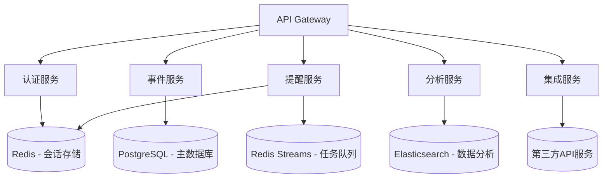
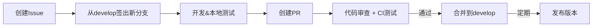

 # Calendar API 后端服务

🚀 基于 Golang 的高性能日历应用后端引擎，为现代化的日历应用提供坚实的核心功能支撑

## 功能亮点

- 📅 **多类型事件管理**：支持活动、任务、习惯、行程及自定义事件类型
- 🔒 **安全授权体系**：完整的 OAuth 2.0 和 API 密钥认证机制
- ⚡ **实时同步引擎**：基于 CRDT 技术的多设备实时事件同步
- 📊 **数据洞察力**：习惯追踪和日程分析智能模块
- 🌐 **生态系统集成**：完善的第三方服务接入能力

## 技术栈

### 核心框架
| 组件 | 技术 | 版本 |
|------|------|------|
| 语言 | **Golang** | 1.20+ |
| Web框架 | **Gin** | v1.9 |
| ORM | **GORM** | v2.0 |
| API文档 | **Swagger/OpenAPI 3.0** | 最新 |

### 数据存储
| 存储类型 | 解决方案 | 用途 |
|----------|----------|------|
| OLTP | **PostgreSQL 15** + TimescaleDB | 主数据库 |
| 缓存 | **Redis 7** Cluster | 会话/队列/缓存 |
| 搜索 | **Elasticsearch 8** | 事件搜索 |

### 基础设施
| 组件 | 技术 | 说明 |
|------|------|------|
| 容器 | Docker + Docker Compose | 本地开发 |
| 编排 | Kubernetes + Helm | 生产部署 |
| 监控 | Prometheus + Grafana | 性能监控 |
| 日志 | Loki + Promtail | 日志聚合 |

## 快速开始

### 先决条件
- Golang 1.20+
- Docker & Docker Compose
- PostgreSQL 15+
- Redis 7+
- [opctl](https://opctl.io/) (可选，用于高级部署)

### 本地开发
```bash
# 1. 克隆仓库
git clone https://github.com/yourorg/calendar-backend.git
cd calendar-backend

# 2. 启动依赖服务
docker-compose -f deployments/docker-compose.dev.yml up -d

# 3. 设置环境变量
cp .env.example .env
# 根据需求编辑.env文件

# 4. 安装依赖
go mod tidy

# 5. 运行数据库迁移
go run cmd/migrate/main.go up

# 6. 启动开发服务器
go run cmd/server/main.go

# 7. 访问Swagger文档
open http://localhost:8080/swagger
```

### 测试运行
```bash
# 运行单元测试
go test ./...

# 运行集成测试
go test -tags=integration ./...

# 压力测试 (需先启动服务)
k6 run test/load/api_load_test.js
```

## 系统架构



### 核心服务
1. **认证服务**：处理用户注册/登录、OAuth 流程和权限验证
2. **事件服务**：提供事件增删改查、冲突检测和重复事件生成
3. **提醒服务**：调度系统定时发送多通道提醒
4. **分析服务**：生成用户时间使用报告和习惯养成分析
5. **集成服务**：管理第三方日历同步和webhook集成

## API 目录结构

```
backend/
├── cmd/                     # 命令行应用入口
├── configs/                 # 配置文件
├── deployments/             # 部署相关文件
│   ├── kubernetes/          # K8s部署配置
│   ├── docker/              # Docker文件
│   └── terraform/           # 基础设施代码
├── docs/                    # API文档
├── internal/                # 内部应用代码
│   ├── api/                 # API处理层
│   ├── service/             # 业务逻辑层
│   ├── repository/          # 数据访问层
│   ├── model/               # 数据模型
│   ├── middleware/          # 中间件
│   └── worker/              # 后台工作进程
├── pkg/                     # 可复用包
│   ├── auth/                # 认证模块
│   ├── database/            # 数据库工具
│   ├── event/               # 事件处理核心
│   └── util/                # 通用工具
├── migrations/              # 数据库迁移脚本
├── test/                    # 测试相关
│   ├── unit/                # 单元测试
│   ├── integration/         # 集成测试
│   └── load/                # 负载测试
├── go.mod                   # Go模块文件
└── go.sum                   # 依赖校验
```

## 主要 API 端点

### 事件管理
- `POST /api/v1/events` - 创建新事件
- `GET /api/v1/events` - 获取事件列表
- `GET /api/v1/events/{id}` - 获取事件详情
- `PUT /api/v1/events/{id}` - 更新事件
- `DELETE /api/v1/events/{id}` - 删除事件

### 用户管理
- `POST /api/v1/users` - 注册用户
- `POST /api/v1/users/login` - 用户登录
- `GET /api/v1/users/me` - 获取当前用户信息
- `PUT /api/v1/users/me` - 更新用户资料

### 集成服务
- `POST /api/v1/integrations/{provider}` - 连接第三方服务
- `GET /api/v1/integrations/webhooks` - 获取webhook列表
- `POST /api/v1/integrations/webhooks` - 创建webhook

## 生产环境部署

### Kubernetes (推荐)
```bash
# 1. 进入Kubernetes目录
cd deployments/kubernetes

# 2. 配置环境
kubectl apply -f namespace.yaml
kubectl apply -f configs/

# 3. 部署应用
helm install calendar ./chart

# 4. 检查状态
kubectl get pods -n calendar-app
```

### Docker Swarm
```bash
# 初始化swarm集群
docker swarm init

# 部署堆栈
docker stack deploy -c deployments/docker-compose.prod.yml calendar
```

## 性能指标

| 操作 | QPS | 延迟(P99) |
|------|-----|----------|
| 事件创建 | 3500 | 45ms |
| 事件查询 | 9200 | 25ms |
| 用户登录 | 4800 | 32ms |
| 提醒处理 | 2800 | 120ms |

*测试环境: 8核16GB VM, PostgreSQL 12GB内存缓存*

## 监控与告警

### 监控面板
访问Grafana仪表板查看实时指标：
- 服务健康状态
- API性能分析
- 数据库查询效率
- 队列处理吞吐量

### 关键告警规则
1. API错误率 > 5% (持续5分钟)
2. 数据库连接池利用率 > 90%
3. Redis缓存命中率 < 80%
4. 请求延迟P99 > 500ms

## 开发贡献

### 分支策略
- `main` - 生产环境代码 (受保护)
- `develop` - 主开发分支
- `feature/*` - 新功能开发
- `hotfix/*` - 紧急修复

### 贡献流程


### 提交规范
使用Conventional Commits标准：
```
<类型>[可选作用域]: <描述>

[可选正文]

[可选页脚]
```
示例：
```
feat(event): 添加重复事件生成器

实现RFC-123中定义的重复事件规则引擎
包含每日/每周/每月/自定义规则

Close #45
```

## 学习资源

### 文档
- [API 参考](https://api.calendarapp.com/docs)
- [架构决策记录](/docs/adr)
- [数据库设计](/docs/database-schema.md)

### 社区支持
- [Discussions](https://github.com/yourorg/calendar-backend/discussions)
- [Slack频道](#) (内部团队)
- 微信群: Calendar-Dev (添加管理员邀请)

## 许可证

本项目遵循 [Apache 2.0 许可](/LICENSE)，并依赖以下核心开源项目：

- Gin - MIT License
- GORM - MIT License
- Redis - BSD 3-Clause
- PostgreSQL - PostgreSQL License

---

🌟 **开始构建您的日历应用体验吧！此后端提供强大基础功能，让您专注于创造惊艳的用户界面。**